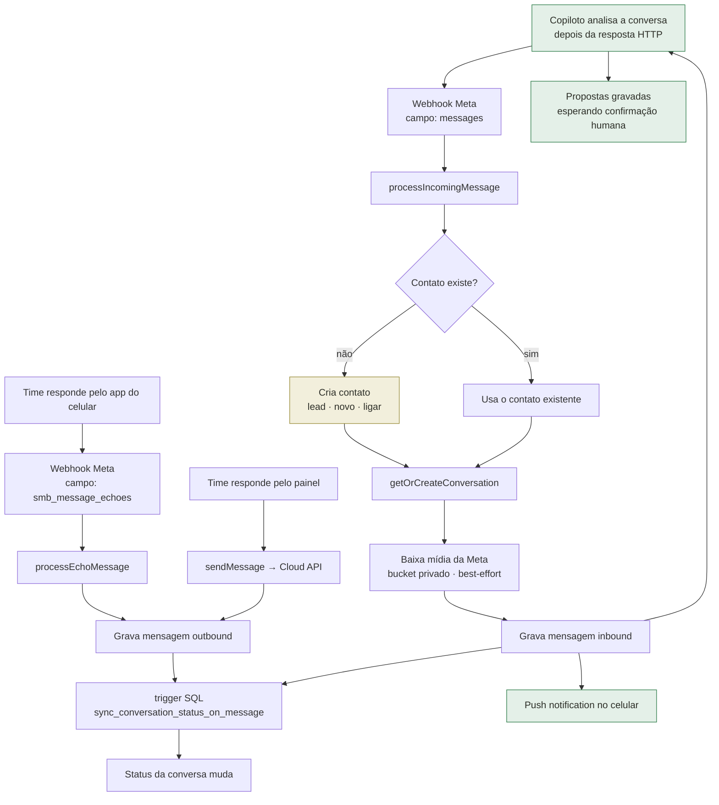
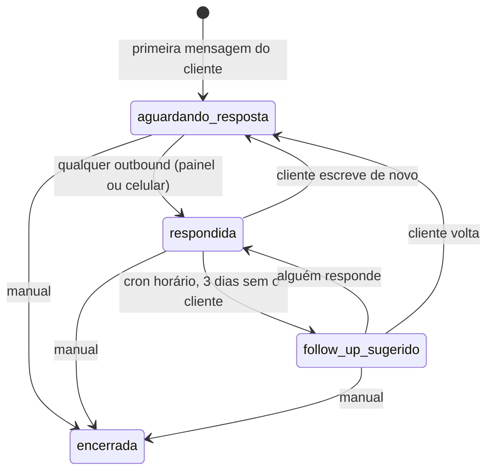
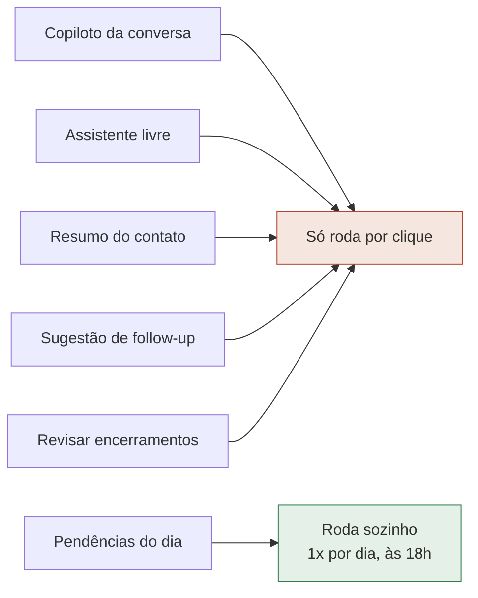
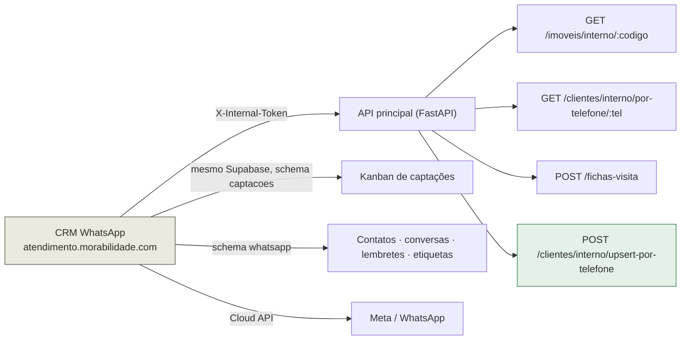

# Mapa do fluxo de atendimento

Extraído do código em 2026-08-02. Serve para responder uma pergunta só: **onde
o tempo da operação vaza, e onde um agente pode entrar sem risco.**

Quem mudar o fluxo (webhook, cron, trigger de status, ação do copiloto) atualiza
este arquivo junto — ele só vale enquanto bater com o código.

> Cores dos diagramas: fundos claros com traço na paleta do produto (oliva
> `#585a4f`, dourado `#9a8d3a`, ember `#b0442e`, jade `#2e7d4a`), para renderizar
> legível tanto no tema claro quanto no escuro do GitHub.

---

## 1. Como o trabalho chega

**Este diagrama já foi o mapa de onde o automático parava.** Até 2026-08-02 ele
terminava em "grava e notifica": qualquer análise dependia de alguém abrir a
conversa e clicar. Hoje a análise dispara aqui, fora do caminho da resposta
(`after` do Next — a Meta reentrega se o 200 demorar), e o rascunho fica
guardado esperando. O que **não** mudou é a trava: proposta continua sendo
proposta até um humano confirmar.

Três guardas evitam desperdício: dedupe por mensagem (a Meta reentrega),
desistência em rajada (só a última mensagem paga a chamada de modelo) e
supersessão das pendentes quando o assunto muda. Ver
`services/agent-proposals.service.ts`.

---

## 2. Máquina de estados da conversa

Vive num trigger de banco (`0009_fase1_status_conversa.sql`, ajustado em
`0010_fase2_pendencias.sql`) — não em código de aplicação.

O botão "Adiar" grava `follow_up_snoozed_until = +1 dia`. Ele **não muda o
status** — só tira a conversa da fila. Qualquer mensagem nova, de qualquer lado,
cancela o adiamento.

**Limitação estrutural:** este estado descreve *quem falou por último*, não *em
que ponto do processo a conversa está*. Não existe nenhum campo dizendo "captação
na etapa 2 de 5" ou "esperando as fotos". Por isso o copiloto reconstrói o
contexto do zero a cada clique, relendo até 60 mensagens.

---

## 3. Gatilhos automáticos que já existem

Todos disparados por relógio — nenhum por evento.

| Quando | Rota | O que faz | Onde mora o agendador |
|---|---|---|---|
| Hora em hora | `/api/cron/follow-up-cooldown` | `respondida` + 3 dias sem o cliente → `follow_up_sugerido` | GitHub Actions |
| Hora em hora | `/api/cron/awaiting-alerts` | `aguardando_resposta` há +2h → alerta no WhatsApp do plantão, máx. 1×/dia por conversa | GitHub Actions |
| Hora em hora | `/api/cron/visita-fichas` | Visita começando em ≤90min → gera a ficha na API principal → link pro cliente → template → plantão | GitHub Actions |
| 18h (21h UTC) | `/api/cron/daily-summary` | Resumo do dia + seção de IA com pendências | `vercel.json` |

> Os horários moram no GitHub Actions porque o plano Hobby da Vercel só executa
> cron 1×/dia e rejeita o deploy inteiro se o `vercel.json` pedir mais.

---

## 4. Onde a IA está hoje — e como ela dispara

| Recurso | Função | Gatilho |
|---|---|---|
| Copiloto da conversa | `analisarEGuardar` → `proporAcoesDaConversa` | **automático, quando a mensagem chega** |
| Assistente livre | `proporAcoes` (`/assistente`) | botão |
| Resumo do contato | `generateConversationSummary` | botão |
| Sugestão de follow-up | `generateFollowUpSuggestion` | botão |
| Revisar encerramentos | `classificarEncerramentos` | botão |
| Pendências do dia | `gerarAnalisePendenciasDoDia` | **automático, 18h** |

Eram 5 de 6 só por clique. O copiloto da conversa — o de maior uso — passou a
rodar por evento: quando a mensagem chega, não quando alguém lembra. Os outros
quatro continuam manuais.

### Manual de voz

O *processo* (o que propor) mora no prompt de `services/assistant/index.ts`. A
*voz* (como escrever) mora em `VOZ.md`, na raiz, editável por quem atende sem
tocar em código. Cada proposta grava `voz_hash` + `modelo`, para separar "o
modelo mudou" de "mexeram no manual".

### Ações que o modelo pode propor

Três, definidas em `services/assistant/tools.ts`:

| Ferramenta | Efeito | Trava |
|---|---|---|
| `agendar_visita` | Cria lembrete de visita com corretor e código do imóvel | Horário revalidado no servidor: 08–19h, sem domingo, ≤60 dias |
| `criar_captacao` | Cria cartão no Kanban de captações | Endereço obrigatório |
| `sugerir_resposta` | Envia mensagem ao cliente | Texto editável antes do envio |

O contrato é sempre o mesmo: **o modelo propõe, o humano confirma, o servidor
revalida.** `handlers.ts` nunca confia nos argumentos que o modelo devolveu.

---

## 5. Integrações

Tudo em `lib/backoffice-api.ts` é best-effort e devolve `null` em falha — exceto
`criarFichaVisita`, que lança de propósito: o cron precisa distinguir "não deu
para gerar" (vira pendência com o motivo exato) de "gerou".

**O fluxo deixou de ser de mão única.** Até 2026-08-03 o CRM só sabia *consultar*
clientes: quem chegava pelo WhatsApp — que é como quase todo lead chega — ficava
preso no schema do chat, invisível para `/clientes`, para os relatórios, para o
matching e para a própria ficha de visita, que saía com `cliente_id` nulo
justamente para quem tinha visita marcada. O upsert fecha esse ciclo.

A promoção acontece em **evento de compromisso**, nunca por passagem de olho —
abrir uma conversa não cria cliente. Hoje são três:

| Evento | Onde |
|---|---|
| Atendente salva a ficha com categoria ≠ lead | `app/contatos/actions.ts` |
| Visita vira ficha (1h antes) | `services/ficha-visita.service.ts` |
| 1ª mensagem cita um imóvel do catálogo | `services/lead-origem.service.ts` |

Duas travas valem para os três: `qualificaParaCliente` recusa contato cujo nome
é só o telefone formatado (senão a base encheria de "(21) 97195-7245"), e o
upsert da API **só preenche campo vazio** — nome, tipo e observação que um
humano escreveu nunca são sobrescritos por inferência.

---

## 6. Os buracos — onde o tempo vaza

| # | Buraco | Situação |
|---|---|---|
| 1 | ~~Nada acontece quando a mensagem chega.~~ | ✅ **Resolvido** — a análise dispara no webhook (`agent-proposals.service.ts`) |
| 2 | **A fila "aguardando resposta" é mecânica.** Um "obrigada!" entra na fila igual a uma pergunta. | Aberto — `classificarEncerramentos` existe, falta o gatilho |
| 3 | **Não existe estado de processo.** A conversa sabe quem falou por último, não em que etapa da captação está. | Parcial — a proposta pendente já carrega o "próximo passo", mas a etapa em si continua implícita |
| 4 | **Não existe roteamento.** Todo contato novo entra como `lead`/`novo`/`ligar`, sem corretor e sem etiqueta — mesmo quando a 1ª mensagem já diz "tenho um apartamento pra alugar". | Aberto — Nível 2 |
| 5 | ~~As propostas do copiloto não persistem.~~ | ✅ **Resolvido** — tabela `agent_proposals` (migration 0020) |
| 6 | **`follow_up_sugerido` não vem com texto.** O cron marca o status; a mensagem só existe se alguém abrir a ficha e clicar. | Aberto — mesma tabela serve, falta ligar no cron |
| 7 | **Fora do horário e fim de semana: silêncio total.** | Aberto — Nível 3 |
| 8 | ~~O lead do WhatsApp não existe no sistema.~~ | ✅ **Resolvido** — upsert por telefone + promoção em evento de compromisso |
| 9 | ~~O código de imóvel que o site injeta na 1ª mensagem é jogado fora.~~ | ✅ **Resolvido** — `lead-origem.service.ts` vincula o imóvel e atribui a origem |
| 10 | ~~Custo de IA sem teto nem medição.~~ | ✅ **Resolvido** — livro-razão `agent_runs` (0021) + teto horário do caminho automático |
| 11 | **O copiloto não enxerga o catálogo.** As três ferramentas são de escrita; nenhuma de leitura. Ele não pode responder "tem 2 quartos em Botafogo?". | Aberto — é o próximo teto de qualidade do agente |
| 12 | **Matching não chega ao chat.** A API tem preferências e matches; a conversa é onde a preferência é dita. | Aberto |
| 13 | **Ficha assinada não volta pro chat.** Nem mensagem, nem timeline, nem lembrete de pós-visita. | Aberto |

---

## 7. Onde o agente entra — escada de autonomia

A régua não é "o agente é bom o bastante?", é **"o que acontece se ele errar?"**.

### Nível 1 — pré-computar (o agente chega antes do humano) — ✅ implementado

Ganho máximo, risco praticamente zero: o agente nunca fala com o cliente, só
deixa o trabalho pronto.

- Mensagem chega → análise dispara no webhook → **rascunho de resposta e ações
  propostas já esperando** quando alguém abre a conversa.
- Resolveu os buracos **1 e 5**; **3** ficou parcial e **6** tem a tabela pronta,
  falta ligar no cron de follow-up.
- Onde mora: `services/agent-proposals.service.ts`, migration `0020`,
  `lib/after-response.ts`, `VOZ.md`.

**Validação em tudo, por enquanto.** Nenhum processo está liberado para agir
sozinho — nem os triviais. O placar em `/pendencias` (taxa de edição e sequência
de aprovações sem edição) é a régua para promover caso a caso, quando houver
base. Ele é indicador, não gatilho: nada muda de comportamento sozinho.

**O papel do agente é organizacional (2026-08-03).** Ele arruma o CRM a partir
do que já foi dito — captação com os dados que o proprietário passou, visita que
ficou combinada — e **não redige resposta a cliente**, nem como rascunho. O
atendimento continua sendo de gente. `AGENTE_MODO=completo` religa
`sugerir_resposta`; o padrão é `organizacional`, e valor inválido cai no
restrito.

Isso é decisão de produto e de custo na mesma direção: escrever para o cliente
exige o `VOZ.md` inteiro no prompt (~1.500 tokens de entrada em toda chamada) e
devolve um texto na saída, que é o token mais caro que existe.

**Controle de custo.** Quatro camadas, da mais barata para a mais cara:

| Camada | O que faz |
|---|---|
| Guarda de conteúdo | "ok", "obrigado", figurinha e mídia sem legenda não viram chamada. A chamada que não acontece custa zero. |
| Prompt enxuto | Sem manual de voz, 20 mensagens de histórico (em vez de 60), `max_tokens` 512 (em vez de 1536) |
| Prefixo cacheável | Instruções estáticas no `system` com `cache_control`; relógio, contato e histórico **depois** do corte — antes o relógio invalidava o cache a cada minuto |
| Tetos | `AI_MAX_CHAMADAS_HORA` (padrão 60, contra rajada) e `AI_MAX_TOKENS_DIA` (padrão 2M, contra custo). Qualquer um em `0` desliga o automático sem redeploy |

**Clique de painel nunca é barrado**: quem clicou tem intenção, e negar isso
custa mais em confiança do que a chamada custa em dinheiro.

**Escolha de modelo.** `AI_MODEL_TRIAGEM` separa o caminho de alto volume do
resto. **O padrão cai em `AI_MODEL`, ou seja, nada muda sozinho** — trocar
modelo é decisão de quem opera. A conta: Haiku 4.5 custa US$ 1/US$ 5 por milhão
de tokens contra US$ 3/US$ 15 do Sonnet 5 — **um terço**, na entrada e na saída.
Extrair endereço e data de uma conversa curta é exatamente o trabalho em que o
modelo barato empata com o caro.

**Sobre o cache, uma ressalva honesta:** o prefixo só entra em cache acima de um
mínimo (1.024 tokens no Sonnet, 4.096 no Haiku), e o prompt organizacional é
curto — pode ficar abaixo dos dois, e a API não avisa. Por isso `agent_runs`
grava `cache_read_tokens` separado: a resposta é observar, não supor. Escrever
no cache custa 25% **a mais** que entrada normal, então cache só compensa com
releitura de verdade.

A contabilidade toda sai de `agent_runs` (migration 0021), convertida em dólares
por `lib/ai-pricing.ts` — não dá para pôr teto no que não se mede.

### Nível 2 — executar com veto (reversível, avisa depois)

Coisas em que o erro é barato e desfazível num clique:

- Etiquetar, classificar categoria do contato, atribuir corretor;
- Tirar encerramento da fila (`classificarEncerramentos` já existe — falta o gatilho);
- Abrir captação em rascunho quando um proprietário oferece imóvel;
- Escrever o texto do follow-up junto com a marcação do status.
- Resolve os buracos **2, 4, 6**.

### Nível 3 — responder sozinho, em faixa estreita

Só onde a resposta é **checklist factual**, não julgamento:

- Fora do horário → acusa recebimento e informa o retorno (resolve o buraco 7);
- Proprietário oferecendo imóvel → conduz a coleta (endereço, quartos, banheiros,
  portaria, fotos) até completar e entrega pronto.

O segundo caso é o melhor candidato do sistema inteiro: pergunta fechada,
resposta verificável, e o pior erro possível é perguntar de novo algo que já foi
respondido.

### Nunca autônomo

**Preço, disponibilidade, condição jurídica, negociação.** Numa imobiliária isso
não é risco de experiência — é risco de CRECI.
